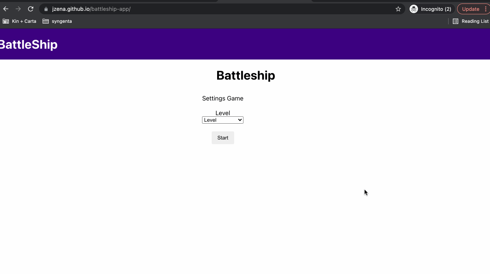

# 1) Demo

Puedes ver aqui un [Demo](https://jzena.github.io/battleship-app/).



# 2) Clonar el repositorio y ejecutar

```cmd
git clone git@github.com:jzena/battleship-app.git
cd battleship-app
npm install
npm start
```

**Al intentar correr el repositorio, en caso la compilación muestre un error de
finalización de linea con CRLF**.

Ejecuta el siguiente codigo:

```powershell
npx eslint --fix src/
```

# 3) Topicos importantes

en este proyecto enfocado al ambiente de produccion hemos implementado las
siguientes caracteristicas tecnicas:

- Bundle-analizer: para saber en todo momento posibles causas de performance
- React Lazy/suspense: para generación de chunks
- e2e test: con cypress y generación de coverage
- commit-lint/husky: para verificacion de mensajes de commit
- Prettier
- SlintConfig
- Format
- Router private/public: manejo de rutas privadas y publicas
- deploy: procesos de build y deploy
- State Management: hemos usado redux-toolkit como ayuda para el manejo de la
  data cross app utilizanso createSlice para el manejo de la inmutabilidad

## 3.1) ejecutar bundle analizer

para ver la grafica y el analisis del bundle puedes ejecutar:

```cmd
npm run build
npm run analize
```

## 3.2) ejecutar e2e test

para ejecutar los e2e test debes ejecutar:

```cmd
npm start
npx cypress open
```

## 3.3) generar coverage

para generar y visualizar el codecoverage/report:

```cmd
npm run coverage
npx run open-coverage-report
```

## 3.4) hacer un deploy

para hacer un nuevo deploy debes ejecutar:

```cmd
npm run predeploy
npx run deploy
```
