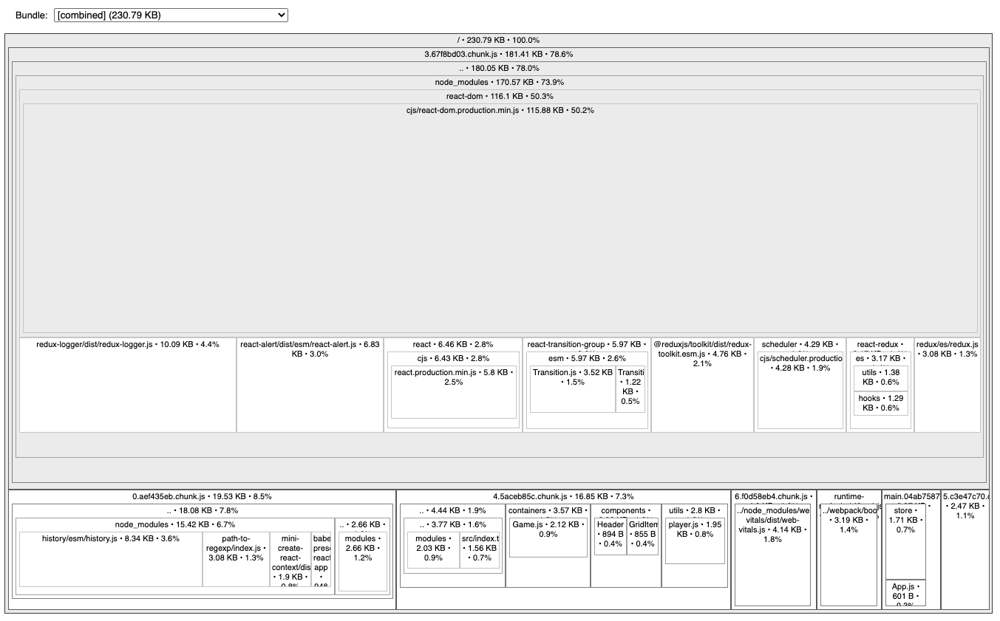
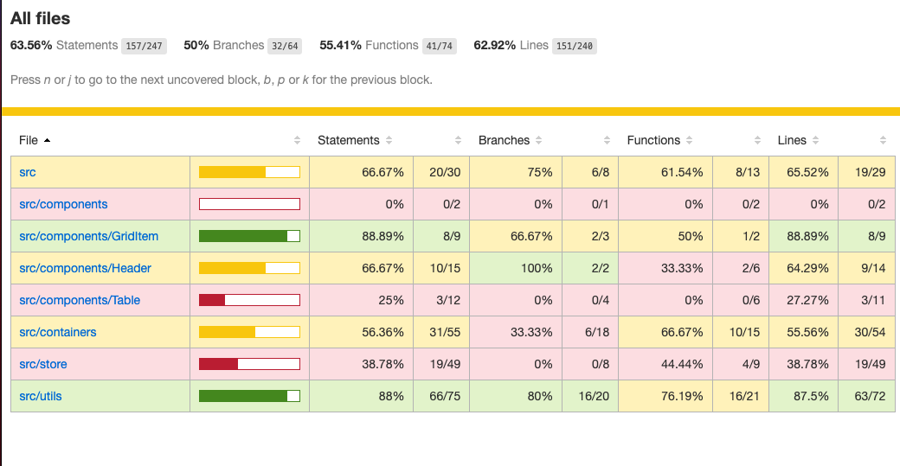

# 1) Demo

You can see a [Demo](https://jzena.github.io/battleship-app/) here.


# 2) Clone the repository and run

```cmd
git clone git@github.com:jzena/battleship-app.git
cd battleship-app
npm install
npm start
```

**When trying to run the repository, in case the compilation shows a line completion error with CRLF .**.

Run the following code:

```powershell
npx eslint --fix src/
```

# 3) Important Topics

In this project focused on the production environment we have implemented the following technical characteristics:

- Bundle-analizer: to know at all times possible causes of performance
- React Lazy/suspense: for generation of chunks
- e2e test: with cypress and coverage generation
- commit-lint/husky: for verification of commit messages
- Prettier
- SlintConfig
- Format
- Router private/public: management of private and public routes
- deploy: build and deploy processes
- State Management: we have used redux-toolkit to help manage the data cross app using createSlice for handling immutability

## 3.1) run bundle analyzer

to see the graph and the analysis of the bundle you can execute:

```cmd
npm run build
npm run analize
```


## 3.2) run e2e test

to run the e2e tests you must run:

```cmd
npm start
npx cypress open
```

## 3.3) generate coverage

to generate and display the codecoverage / report:

```cmd
npm run coverage
npx run open-coverage-report
```


## 3.4) do a deploy

to make a new deploy you must execute:

```cmd
npm run predeploy
npx run deploy
```
